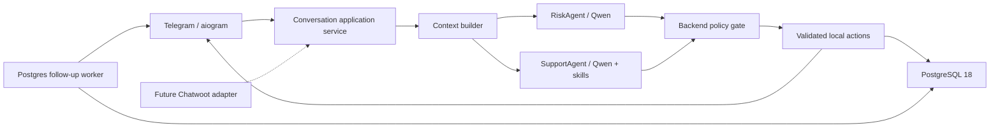

# Telegram-агент Невидимого фонда: дизайн MVP

Дата: 2026-08-15  
Статус: согласовано для реализации  
Продуктовый источник: [`chatbot_spec_nevidimiy_fond.md`](../../../chatbot_spec_nevidimiy_fond.md)

## Цель и границы

MVP даёт женщине короткий русскоязычный разговор в Telegram: помогает назвать
актуальную потребность, предлагает подходящие варианты помощи первого уровня,
принимает один выбранный вариант и контакт, фиксирует запрос на помощь, замечает
кризисные сигналы и возвращается за обратной связью. Разговор следует принципам
мотивационного интервью и Intentional Peer Support, но не превращается в анкету.

Текущий бот доступен только команде тестирования, однако в самом разговоре он
полностью играет роль работающего фонда. Пользовательские сообщения не содержат
плашек «тест», «прототип» или условных обещаний. На тестовом контуре помощь
считается доступной, а её фактическая выдача пока заменена созданием заявки в БД.

В этой версии:

- единственный пользовательский канал — Telegram через aiogram long polling;
- Chatwoot, WhatsApp и web-chat не подключаются, но будущий Chatwoot сможет
  подавать те же входные события и принимать те же действия агента;
- живой координатор не подключается: эскалация симулируется текстом и событием БД;
- возраст не спрашивается и не выводится моделью; отдельная политика работы с
  несовершеннолетними обязательна до внешнего пилота;
- голос, фото, видео и документы не анализируются; бот просит написать текстом;
- каталог помощи и юридическая база искусственные, но имеют ту же структуру,
  в которой позже будут храниться реальные проверенные записи.

## Главные продуктовые правила

1. На каждом экране присутствует действие «Поговорить с живым человеком».
2. Если бот предлагает конечный набор вариантов, каждый вариант показывается
   Telegram-кнопкой. Свободный текст принимается на любом шаге.
3. Вопросы остаются открытыми по интонации: бот отражает услышанное, коротко
   объясняет варианты и оставляет окончательный выбор женщине.
4. Бот не спрашивает имя, точный адрес и документы. Для физической помощи он
   может спросить город, затем район или удобный пункт выдачи. Всегда допустимо
   не указывать место и перейти к человеку.
5. Для одной заявки выбирается один вид помощи. После сохранения заявки бот
   спрашивает, нужно ли что-то ещё; новый выбор создаёт новую заявку.
6. Контакт запрашивается только после выбора помощи. Можно передать текущий
   Telegram username, указать другой Telegram, телефон, email, отложить или
   попросить человека.
7. Отказ и «позже» принимаются без давления. После фолоуапа допускается только
   одно мягкое напоминание.
8. Эталонные S01–S19 задают смысл и тон, а не требуют дословного воспроизведения.

## Архитектура

Telegram — тонкий транспорт: преобразует команду, текст или callback в единый
`IncomingMessage` и отображает `AgentTurn` как текст с inline-кнопками. Вся
продуктовая логика живёт в application service и не зависит от aiogram.

На каждый обычный текстовый ход запускаются ровно два независимых HTTP-вызова
Qwen параллельно через `asyncio.gather`:

- `RiskAgent` возвращает JSON-оценку риска, которую локально валидирует Pydantic;
- `SupportAgent` читает всю сохранённую за 30 дней историю, доступный каталог,
  подходящие выдержки курируемой базы и поведенческие skills, после чего
  возвращает одно финальное JSON-действие, которое локально валидирует Pydantic.

Это не агентный цикл с повторными tool round trips. Модель выбирает действие,
но backend валидирует и исполняет его только после получения RiskAgent. Никакая
заявка, эскалация или смена состояния не создаётся до safety gate.

Compatibility smoke (2026-08-20) показал, что Qwen3.6 35B завершает обычный
Responses-вызов при `reasoning.effort=none`, но native `json_schema` для него
возвращает `model_call_error`. Поэтому используются PydanticAI `PromptedOutput`
и локальная Pydantic-валидация JSON: схема включается в instructions, но не
передаётся как native `text.format`. В логах остаются только hash, usage,
response ID и безопасный тип ошибки. LangChain и LangGraph для этого одноходового
графа не нужны.

## Skills и actions

Skills — небольшие каталоги с `SKILL.md`, которые описывают способ вести часть
разговора и содержат эталонные примеры смысла и тона:

- `needs-discovery` — мягко выявить первичную потребность;
- `offer-aid` — выбрать 3–4 релевантных позиции только из каталога;
- `collect-contact` — объяснить, зачем нужен контакт, и не запрашивать лишнее;
- `crisis-escalation` — коротко ответить на угрозу и сохранить возможность
  продолжить разговор;
- `verified-information` — отвечать только по одобренной базе;
- `follow-up` — S15–S18 и единственное мягкое напоминание;
- `level-two-support` — рассказать о системной помощи и предложить человека.

Все skills загружаются в system prompt SupportAgent. Их мало, поэтому отдельный
LLM-вызов для выбора или динамической загрузки skill в MVP не нужен.

Typed actions — не инструкции модели выполнить код, а проверяемый контракт её
финального ответа:

- `reply` — свободная короткая реплика;
- `show_choices` — вопрос и разрешённые кнопки;
- `offer_aid` — 3–4 позиции из переданного каталога;
- `request_location` — город/район только для физической помощи;
- `request_contact` — разрешённые способы связи;
- `create_aid_request` — один catalog item и выбранный контакт;
- `record_escalation` — причина и безопасный пользовательский ответ;
- `offer_more_help` — начать ещё одну заявку или завершить;
- `close_conversation` — открытое завершение без удаления общей сессии.

Backend добавляет кнопку человека к любому набору, запрещает неизвестные
callback/action/catalog IDs и заменяет невалидный ответ безопасным
детерминированным экраном.

## Диалог и состояние

У одного Telegram-пользователя всегда одна долговечная `Conversation`. `/start`
не создаёт новую сессию: он показывает S01 и переоткрывает текущий разговор.
Заявки, контакты, эскалации и фолоуапы — отдельные записи, поэтому новая нужда не
затирает старую.

Минимальные состояния разговора:

- `greeting` — S01;
- `discovering_need` — S03/S04;
- `choosing_aid` — S05–S09;
- `collecting_location` — город/район при необходимости;
- `collecting_contact_method` и `collecting_contact_value` — S10;
- `aid_requested` — заявка сохранена;
- `followup_waiting`, `followup_sent`, `followup_answered` — S15–S18;
- `closed` — S02/S19, но новый текст вновь открывает тот же разговор.

Callback payload содержит стабильный короткий action ID, а не видимый label.
Старые или повторно нажатые кнопки безопасно интерпретируются по серверному
состоянию: действие не должно повторно создавать одну и ту же заявку.

## Safety gate

RiskAgent классифицирует смысл сообщения в один уровень и категории:

- `critical` — суицидальные намерения, насилие прямо сейчас, непосредственная
  угроза жизни или ребёнку;
- `urgent` — сегодня негде ночевать, выгнали, улица этой ночью;
- `concern` — нестабильное жильё, страх или угроза без непосредственной опасности;
- `human_requested` — прямой запрос живого человека;
- `none` — красных флагов нет.

Локальный high-precision detector остаётся аварийным слоем для явных фраз и
работает до/вместе с LLM. Итоговый риск — наиболее строгий из локального и
модельного. Сбой/timeout RiskAgent даёт `unknown`, создаёт техническое событие и
не разрешает SupportAgent совершать side effect; пользователю возвращается
короткий безопасный выбор продолжить или позвать человека.

При `critical` результат SupportAgent отбрасывается. Для суицидального смысла
ответ обязательно содержит `8-800-2000-122` точно в согласованном виде. Для
непосредственной внешней опасности допускается 112. Эскалация записывается в БД;
пользователь может продолжать писать боту. При `urgent`, `concern` и
`human_requested` событие также сохраняется, но обычный разговор может
продолжиться. Будущий координатор сможет принять управление вместо бота через
Chatwoot; в текущем MVP это только состояние/событие и текстовое обещание позвать
человека.

## Каталог и проверенная информация

`aid_catalog` содержит стабильный ID, название, описание, тип потребности,
признак необходимости географии/контакта и доступность. SupportAgent получает
только доступные записи и не может придумать новую услугу.

`knowledge_articles` содержит тему, регион, текст, источник, владельца, дату
проверки, срок действия и status. В prompt попадают только записи
`approved` с неистёкшей датой. Для маленькой искусственной базы retrieval
детерминированный по темам; pgvector не нужен. Ответ по праву или организации
обязан опираться на найденную запись и показывать источник/дату проверки. Если
поддержки в базе недостаточно, бот честно предлагает юриста или живого человека
и не делает собственного правового вывода.

## Хранение и приватность

PostgreSQL хранит:

- одну `conversations` на Telegram-пользователя;
- `messages` с полным локальным текстом, ролью, Telegram metadata и UI metadata;
- `risk_assessments`, `agent_runs`, `action_executions` и агрегатные `events`;
- `aid_catalog`, `aid_requests`, `contact_points`, `escalations`;
- `knowledge_articles`, `followup_jobs`.

Для связи с Telegram нужен обратимый chat ID, поэтому хеш одного ID недостаточен.
В MVP сохраняется platform ID, доступный только приложению/БД; параллельно
считается стабильный hash для аналитики и будущего разделения идентичности и
контента. Перед внешним пилотом platform ID и контакты должны быть зашифрованы
на уровне приложения отдельным ключом.

Полные сообщения хранятся локально 30 дней. После срока worker удаляет тексты и
контактные значения, но может оставить обезличенные события/метрики. `/delete`
сразу удаляет сообщения, контакты и активные задания конкретной conversation,
сохраняя только обезличенный факт удаления.

Вся доступная 30-дневная история передаётся обоим Yandex-агентам только после
локальной маскировки Presidio. Каждый запрос содержит
`x-data-logging-enabled: false`. Prompts и исходный пользовательский текст не
пишутся в application log. Аудит LLM хранит provider, model, response ID,
status, latency, token usage, параметры, input hash, PII counts и ошибку по типу,
но не секреты.

Пользовательский текст не утверждает, что Telegram полностью анонимен или что
данные технически никуда не передаются. Он обещает только фактическое: имя не
обязательно, контакт нужен для выбранной помощи и не используется для других
целей. Отдельного стартового consent screen в MVP нет — это согласованное
ограничение тестирования.

## Фолоуап

После создания заявки backend считает помощь условно переданной и создаёт
`followup_job` на 7 дней. Интервал задаётся конфигурацией, чтобы в тесте ставить
минуты. Один async worker в процессе атомарно забирает due jobs из PostgreSQL,
отправляет S15 и планирует единственное мягкое напоминание через 48 часов. После
ответа или напоминания цепочка закрывается. PostgreSQL позволяет восстановить
очередь после рестарта без Redis и отдельного брокера.

## Ошибки и деградация

- Сбой SupportAgent: короткий детерминированный экран с актуальными кнопками;
- сбой RiskAgent: fail-safe без side effects, событие `risk_agent_failed`;
- невалидный structured output: тот же fallback и audit schema error;
- Yandex недоступен: бот продолжает детерминированные callback-переходы;
- Postgres недоступен: сообщение не подтверждается как заявка, ошибка логируется
  без текста/секретов, процесс остаётся под systemd restart policy;
- Telegram timeout: существующий retry loop восстанавливает polling;
- неизвестный/stale callback: нейтрально предлагает текущие допустимые действия;
- нет текста во входящем сообщении: text-only fallback с текущими кнопками.

## Проверка готовности

Unit tests проверяют risk merge, матрицу помощи, action validation, каждый
callback, идемпотентность заявки, контактные переходы, knowledge policy,
retention и scheduler. Integration tests на PostgreSQL проверяют постоянную
conversation, полный audit, удаление и захват due job. Contract tests мокают два
параллельных Responses-вызова и доказывают, что critical response отбрасывает
SupportAgent action. Golden сценарии покрывают S01–S19, свободный текст,
суицидальный кризис, насилие, острое бездомье, человека, юридический вопрос,
отказ и вторую заявку.

Перед деплоем обязательны `ruff`, весь `pytest`, короткий Yandex compatibility
smoke test и Telegram getMe/polling smoke без вывода токенов. После деплоя
проверяются systemd, build version, отсутствие polling conflict, PostgreSQL и
последние безопасные логи. Внешний пилот остаётся отдельной стадией: политика
несовершеннолетних, реальные каталог/БЗ, шифрование идентичности, координаторское
дежурство/SLA и проверка кризисных текстов должны быть утверждены людьми.
