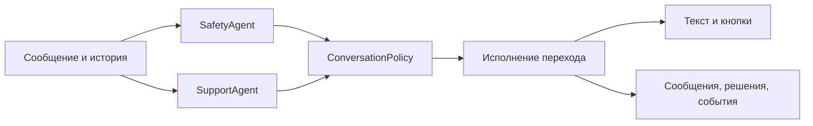

# Свободный разговор и единая политика следующего шага

Дата: 2026-08-21  
Статус: реализовано; финальная локальная и live-приёмка описана ниже
Дополняет: [`2026-08-15-nevidimiy-fond-telegram-agent-design.md`](./2026-08-15-nevidimiy-fond-telegram-agent-design.md)

## Проблема

До изменения реализация смешивала три разные задачи в одной шкале риска и одной FSM:

1. оценку непосредственной опасности;
2. понимание пользовательского намерения;
3. прохождение конечного сценария оформления помощи.

Из-за этого просьба «выслушай меня» может быть истолкована как запрос живого
человека, а обычная реплика SupportAgent — заменена backend-фолбэком на общее
меню потребностей. Текст модели и прикреплённые кнопки при этом формируются
разными правилами и способны противоречить друг другу.

Исправление должно менять не отдельную фразу или callback, а саму модель
принятия решения.

## Продуктовые инварианты

- Свободный разговор с ботом — режим по умолчанию, а не промежуточное состояние
  до показа каталога.
- Фразы «выслушай меня», «мне нужно выговориться», «можно с тобой поговорить?»
  означают продолжение разговора с ботом.
- Переход к живому человеку происходит только по явному запросу: «позовите
  человека», «хочу поговорить со специалисткой», «не хочу общаться с ботом» —
  либо по кризисной политике.
- Угроза жизни и пользовательский запрос человека — разные измерения. Запрос
  человека не является уровнем риска.
- В свободном разговоре бот не показывает общее меню потребностей. На экране
  остаётся только постоянная кнопка «Поговорить с живым человеком».
- Конечный набор конкретных вариантов всегда показывается кнопками. Свободный
  текст принимается на каждом шаге.
- Психолог предлагается естественно внутри разговора: бот продолжает помогать,
  честно обозначает границы и сообщает, что с запросом глубже справится
  специалистка. При осторожном интересе вроде «расскажите» появляется кнопка
  «Хочу поговорить с психологом»; при однозначном «да, хочу» лишнего
  подтверждения кнопкой не требуется.
- После однозначного согласия или выбора кнопки бот запрашивает удобный контакт,
  создаёт заявку в БД и сообщает, что специалистка свяжется. В MVP реальное
  уведомление не отправляется.
- Любой кризис суицидального характера сразу получает согласованный номер
  `8-800-2000-122`.

## Архитектура решения

Каждое обычное текстовое сообщение обрабатывается двумя параллельными вызовами
Qwen и одной детерминированной серверной политикой:



### SafetyAgent

SafetyAgent отвечает только диагностическим наблюдением об опасности:

```text
level: none | concern | urgent | critical | unknown
categories: string[]
confidence: 0..1
rationale: string
evidence_claims?: exact-current-user-span[]
```

`rationale` — каноническое поле. `rationale_short` принимается только как
односторонний alias старого провайдера и фиксируется в аудите без текста
rationale. На gateway точные evidence claims валидируются относительно
последнего сообщения пользователя; в аудит попадают только count/status/hash,
не цитаты. Схемная или транспортная ошибка — `DiagnosticStatus.invalid` либо
`unavailable`, а не локальный `RiskLevel.UNKNOWN`.

`human_requested` удаляется из `RiskLevel`, risk prompt, локального risk detector
и таблицы приоритетов. Локальные правила продолжают страховать явные кризисные
формулировки, но больше не ищут просьбы о человеке.

### SupportAgent

SupportAgent свободно формулирует реплику в рамках системного промпта, но
возвращает только диагностические поля:

```text
intent: typed label
need_hint?: enum
evidence_claims?: exact-current-user-span[]
draft_text: string
suggested_support?: psychologist
```

В его схеме отсутствуют action, choice set, catalog item IDs, callback IDs,
workflow state и effect. Эти диагностические labels и `need_hint` не могут
авторизовать UI, заявку, эскалацию или state transition. `draft_text` допустим
только как guarded copy в открытом разговоре; обещания уже выполненного
внешнего действия (включая принятую заявку или обещание обратной связи) заменяются backend fallback. `suggested_support=psychologist`
может создать только мягкий pending offer без кнопки в этом же ходе.

Примеры принципиальных решений:

- «Мне хочется выговориться» → guarded `draft_text` и backend `choice_set=none`;
- «Мне нужны продукты» → local concrete-aid signal и backend catalog;
- «Можно поговорить с человеком?» → local human signal и backend handoff;
- осторожный интерес после предложения психолога → bounded local signal и
  backend `choice_set=psychologist_interest`;
- однозначное согласие после предложения психолога →
  `psychologist_request` + `start_psychologist_request`.

### ConversationPolicy

`resolve_turn(PolicyContext)` — единственный владелец effect, side effect,
контекстного choice set, state/workflow route, need и catalog selection. Context
содержит состояние, pending offer, deterministic signals, local risk и
диагностические payload/statuses. Политика применяет неизменяемый порядок:

1. verified local critical;
2. verified explicit human request;
3. невозможность локального deterministic inspection;
4. replay активного конечного workflow;
5. verified concern/urgent side effect вместе с совместимым маршрутом;
6. verified psychologist request;
7. verified concrete aid;
8. verified generic aid interest → backend need categories;
9. narrow verified close rule, если он существует;
10. открытый разговор по умолчанию.

Два вызова модели остаются параллельными и обязательными на каждом text turn,
но labels моделей не являются условием, которое авторизует продуктовое действие.
Кнопки рендерятся только из итогового `ResolvedTurn`; `ChoiceSet.NONE` не имеет
контекстных кнопок, а `app/ui.py` всегда добавляет глобальную кнопку человека.

## Состояние разговора и workflows

У пользователя остаётся одна долговечная Conversation и вся её история.
Добавляется верхнеуровневый режим `open_conversation`, который не требует
переходов FSM между репликами.

FSM используется только для конечных workflows:

- выбор конкретной помощи;
- уточнение географии, если она нужна;
- выбор способа и значения контакта;
- сохранение заявки;
- follow-up;
- симулированный handoff.

Начало workflow происходит только после verified deterministic signal. Выход из
workflow возвращает в `open_conversation`, не начинает discovery заново и не
создаёт новую сессию. Generic aid interest запускает backend-owned discovery
need categories; concrete aid сразу использует backend catalog для найденной need.

Предложение психолога само по себе workflow не запускает. SupportAgent может
сохранить только мягкий backend marker предложения. После следующего verified
user signal (в том числе точного bounded acknowledgement `да, хочу` без
дополнительной темы при pending context) политика
показывает кнопку или запускает обычный workflow контакта с типом заявки
`psychologist`. Несвязанная следующая реплика очищает marker; callback
рендерится из marker, но позднее текстовое согласие его не продлевает. Явный
handoff и critical route также очищают marker до возврата в открытый разговор.

## Кнопки и совместимость старых сообщений

Backend содержит реестр `ChoiceSet` с labels и callback IDs. У одного итогового
хода есть один источник правды: `ResolvedTurn(text, choice_set, side_effects,
state_transition)`.

- `none` даёт только глобальную кнопку человека;
- `psychologist_interest` даёт кнопку «Хочу поговорить с психологом» и глобальную
  кнопку человека;
- остальные наборы соответствуют текущим каталогу, контактам и follow-up.

Старые Telegram-кнопки остаются безопасными: callback интерпретируется по своему
стабильному ID, после чего ConversationPolicy либо начинает соответствующий
workflow, либо сообщает, что вариант больше недоступен. Нажатие старой кнопки не
должно возвращать общее меню и не должно повторно создавать заявку.

## Хранение и наблюдаемость

Текущие полные сообщения и model-run metadata продолжают сохраняться. Для
каждого хода дополнительно записываются только структурированные поля:

- состояние и workflow до решения;
- local risk и policy/matcher versions;
- SafetyAgent label/status и SupportAgent intent/status;
- rule IDs и state before/after;
- итоговое policy decision;
- состояние после решения;
- показанный `choice_set` и callback IDs;
- выполненные side effects;
- причина fallback.

Сырые секреты, prompts, история, evidence quotes и model-owned `next_action` в
аудит не добавляются. Эта структура
позволит воспроизводить поведение сессии без чтения application log.

## Ошибки и деградация

- Сбой SafetyAgent не меняет verified local critical/human signal: фиксируется
  diagnostic status, а deterministic policy продолжает свой маршрут.
- Сбой SupportAgent при безопасном local risk → разговорный fallback без общего
  меню.
- Невалидная diagnostic schema → audit status, без side effects от модели.
- Guarded draft с ложным обещанием внешнего действия → backend fallback без
  контекстных кнопок.
- Ошибка БД при создании заявки → бот не обещает, что заявка сохранена, и
  предлагает повторить либо позвать человека.
- Повторный callback → идемпотентный результат без дубля заявки.

### Семантика доставки Telegram

Долговечный outcome и все business effects фиксируются до отправки, а worker
повторяет недоставленный outcome без повторного запуска диагностик или effects.
Граница транспорта имеет семантику **bounded at-least-once**, а не exactly-once:
Telegram Bot API не принимает idempotency key, поэтому в окне
**post-send/pre-ack** успешная отправка может стать видимым дублем, если ACK не
зафиксировался. Outcome остаётся reclaimable и помечается конечной категорией
`delivery_ambiguous`; штатный ACK подавляет replay, а необязательный аудит
assistant-сообщения выполняется после ACK и не может снова открыть доставку.

## Поведенческий тестовый набор

Тестирование проверяет инварианты, а не точное совпадение красивого текста.

### Детерминированный набор

В репозитории хранится версионированный обезличенный JSONL-набор со сценариями:

- обезличенное воспроизведение проблемной production-сессии;
- 40–60 синтетических многоходовых диалогов и перефразировок;
- свободный разговор без появления меню;
- явный запрос человека и близкие, но неявные формулировки;
- предложение психолога, отказ, интерес и создание заявки;
- переходы разговор → помощь, помощь → разговор, разговор → человек;
- кризисные и пограничные формулировки;
- сбои/невалидные ответы агентов и stale callbacks.

Каждый шаг содержит вход, предысторию и ожидаемые ограничения: допустимый risk,
intent/action, наличие или отсутствие choice set, side effects и состояние.

### Уровни проверки

1. Unit: schemas, policy table, choice registry, state transitions.
2. Scenario replay: фиктивные ответы агентов прогоняются через настоящий service
   и хранилище.
3. Live-model eval: `just eval-dialogues-live` запускает тот же набор против Qwen
   и расходует оплачиваемые токены Yandex AI Studio. Команда выводит только IDs
   сценариев, итоговые классификации и нарушения; истории диалогов не сохраняются
   и не печатаются. Нестабильность формулировок не делает обычный unit suite
   недетерминированным.
4. Telegram smoke: отдельный тест проверяет, что итоговые inline-кнопки совпадают
   с policy decision.

Критические инварианты сборки:

- просьба выслушать никогда не создаёт handoff;
- свободный разговор никогда не показывает `need_categories`;
- `explicit_human_request` всегда создаёт событие handoff;
- `critical` всегда переопределяет SupportAgent;
- психологическая заявка появляется только после явного интереса;
- текст и кнопки всегда происходят из одного `ResolvedTurn`.

## Миграция

Изменение выполнено совместимо с текущими данными:

1. `SupportPlan`, `ResolvedTurn` и `ConversationPolicy` заменили legacy-контракт
   модели для текстового пути, сохранив callback workflows;
2. добавлен `open_conversation` и policy audit fields/events;
3. запрос человека перенесён из риска в intent и отдельный escalation cause;
4. добавлены psychologist catalog/workflow и тестовый элемент базы;
5. универсальный fallback на `NEED_CHOICES` и прежний прототипный action-контракт
   удалены; replay и live-model eval служат приёмкой.

Существующие записи `human_requested` в истории не переписываются: они остаются
историческим значением аудита. Новый код их больше не создаёт.

## Критерии готовности

- Проблемная production-сессия воспроизводится тестом и проходит новые инварианты.
- Все существующие сценарии помощи, контакта, кризиса и follow-up продолжают
  работать.
- В live-прогоне «мне просто хочется выговориться» получает содержательный ответ
  без эскалации и без меню потребностей.
- После интереса к психологу создаётся заявка с выбранным контактом.
- В БД можно восстановить решение каждого тестового хода: risk, intent, policy,
  переход, кнопки и side effects.
- Перед деплоем проходят `just check`, `just scenario-smoke`, `just llm-health`,
  `just eval-dialogues` и оплачиваемый `just eval-dialogues-live`.
