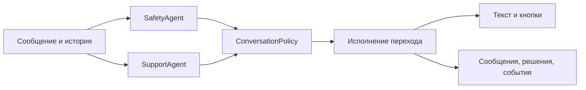

# Свободный разговор и единая политика следующего шага

Дата: 2026-08-21  
Статус: утверждено для реализации
Дополняет: [`2026-08-15-nevidimiy-fond-telegram-agent-design.md`](./2026-08-15-nevidimiy-fond-telegram-agent-design.md)

## Проблема

Текущая реализация смешивает три разные задачи в одной шкале риска и одной FSM:

1. оценку непосредственной опасности;
2. понимание пользовательского намерения;
3. прохождение конечного сценария оформления помощи.

Из-за этого просьба «выслушай меня» может быть истолкована как запрос живого
человека, а обычная реплика SupportAgent — заменена backend-фолбэком на общее
меню потребностей. Текст модели и прикреплённые кнопки при этом формируются
разными правилами и способны противоречить друг другу.

Исправление должно менять не отдельную фразу или callback, а саму модель
принятия решения.

## Продуктовые инварианты

- Свободный разговор с ботом — режим по умолчанию, а не промежуточное состояние
  до показа каталога.
- Фразы «выслушай меня», «мне нужно выговориться», «можно с тобой поговорить?»
  означают продолжение разговора с ботом.
- Переход к живому человеку происходит только по явному запросу: «позовите
  человека», «хочу поговорить со специалисткой», «не хочу общаться с ботом» —
  либо по кризисной политике.
- Угроза жизни и пользовательский запрос человека — разные измерения. Запрос
  человека не является уровнем риска.
- В свободном разговоре бот не показывает общее меню потребностей. На экране
  остаётся только постоянная кнопка «Поговорить с живым человеком».
- Конечный набор конкретных вариантов всегда показывается кнопками. Свободный
  текст принимается на каждом шаге.
- Психолог предлагается естественно внутри разговора: бот продолжает помогать,
  честно обозначает границы и сообщает, что с запросом глубже справится
  специалистка. При осторожном интересе вроде «расскажите» появляется кнопка
  «Хочу поговорить с психологом»; при однозначном «да, хочу» лишнего
  подтверждения кнопкой не требуется.
- После однозначного согласия или выбора кнопки бот запрашивает удобный контакт,
  создаёт заявку в БД и сообщает, что специалистка свяжется. В MVP реальное
  уведомление не отправляется.
- Любой кризис суицидального характера сразу получает согласованный номер
  `8-800-2000-122`.

## Архитектура решения

Каждое обычное текстовое сообщение обрабатывается двумя параллельными вызовами
Qwen и одной детерминированной серверной политикой:



### SafetyAgent

SafetyAgent отвечает только на вопрос об опасности и возвращает:

```text
risk: none | concern | urgent | critical | unknown
categories: string[]
confidence: 0..1
rationale_short: string
```

`human_requested` удаляется из `RiskLevel`, risk prompt, локального risk detector
и таблицы приоритетов. Локальные правила продолжают страховать явные кризисные
формулировки, но больше не ищут просьбы о человеке.

### SupportAgent

SupportAgent свободно формулирует реплику в рамках системного промпта, но также
возвращает проверяемый план:

```text
intent:
  open_conversation | concrete_need | aid_interest | psychologist_considering |
  psychologist_request | verified_information | explicit_human_request | close
next_action:
  continue_conversation | clarify | offer_aid | provide_verified_info |
  request_human | start_psychologist_request | close
text: string
choice_set: none | need_categories | aid_catalog | psychologist_interest |
            contact_methods | more_help
need: optional enum
catalog_item_ids: string[]
```

SupportAgent не создаёт callback ID и не исполняет side effects. `choice_set`
является только символической просьбой к backend показать заранее известный
набор кнопок. Для каталога дополнительно передаются допустимые item IDs.

Примеры принципиальных решений:

- «Мне хочется выговориться» → `open_conversation` +
  `continue_conversation` + `choice_set=none`;
- «Мне нужны продукты» → `concrete_need` + `offer_aid`;
- «Можно поговорить с человеком?» → `explicit_human_request` + `request_human`;
- осторожный интерес после предложения психолога →
  `psychologist_considering` + `clarify` + `choice_set=psychologist_interest`;
- однозначное согласие после предложения психолога →
  `psychologist_request` + `start_psychologist_request`.

### ConversationPolicy

ConversationPolicy получает оба структурированных результата и текущий workflow.
Она одна определяет итоговый переход, side effects и UI:

1. `critical` всегда отбрасывает обычный план и запускает кризисный ответ;
2. `unknown` запрещает side effects и возвращает безопасную деградацию;
3. активный конечный workflow обрабатывает допустимые для него ответы;
4. явный `request_human` создаёт симулированную эскалацию;
5. в остальных случаях исполняется валидный план SupportAgent;
6. невалидный или несогласованный план превращается в свободную безопасную
   реплику без меню, а не в экран первичного выбора.

Политика проверяет соответствие текста и интерфейса. Кнопки рендерятся только из
итогового `choice_set`; старые `AgentAction.choices`, придуманные моделью, больше
не являются источником UI.

## Состояние разговора и workflows

У пользователя остаётся одна долговечная Conversation и вся её история.
Добавляется верхнеуровневый режим `open_conversation`, который не требует
переходов FSM между репликами.

FSM используется только для конечных workflows:

- выбор конкретной помощи;
- уточнение географии, если она нужна;
- выбор способа и значения контакта;
- сохранение заявки;
- follow-up;
- симулированный handoff.

Начало workflow происходит только после ясного намерения или согласия. Выход из
workflow возвращает в `open_conversation`, не начинает discovery заново и не
создаёт новую сессию.

Предложение психолога само по себе workflow не запускает. SupportAgent сохраняет
разговорный контекст, а backend записывает безопасный маркер предложения. После
явного интереса ConversationPolicy запускает обычный workflow контакта с типом
заявки `psychologist`.

## Кнопки и совместимость старых сообщений

Backend содержит реестр `ChoiceSet` с labels и callback IDs. У одного итогового
хода есть один источник правды: `ResolvedTurn(text, choice_set, side_effects,
state_transition)`.

- `none` даёт только глобальную кнопку человека;
- `psychologist_interest` даёт кнопку «Хочу поговорить с психологом» и глобальную
  кнопку человека;
- остальные наборы соответствуют текущим каталогу, контактам и follow-up.

Старые Telegram-кнопки остаются безопасными: callback интерпретируется по своему
стабильному ID, после чего ConversationPolicy либо начинает соответствующий
workflow, либо сообщает, что вариант больше недоступен. Нажатие старой кнопки не
должно возвращать общее меню и не должно повторно создавать заявку.

## Хранение и наблюдаемость

Текущие полные сообщения и model-run metadata продолжают сохраняться. Для
каждого хода дополнительно записываются:

- состояние и workflow до решения;
- SafetyAgent result;
- SupportAgent intent и next action;
- итоговое policy decision;
- состояние после решения;
- показанный `choice_set` и callback IDs;
- выполненные side effects;
- причина fallback или отклонения модельного плана.

Сырые секреты и незамаскированный prompt в аудит не добавляются. Эта структура
позволит воспроизводить поведение сессии без чтения application log.

## Ошибки и деградация

- Сбой SafetyAgent → `unknown`, никакой заявки или эскалации по модельному плану,
  короткая безопасная реплика и кнопка человека.
- Сбой SupportAgent при безопасном risk → разговорный fallback без общего меню.
- Невалидный intent/action/choice set → audit события, свободный fallback без
  side effects.
- Противоречие `text` и `choice_set` → backend заменяет ход целиком заранее
  согласованным экраном соответствующего workflow; он не приклеивает к
  модельному тексту посторонние кнопки.
- Ошибка БД при создании заявки → бот не обещает, что заявка сохранена, и
  предлагает повторить либо позвать человека.
- Повторный callback → идемпотентный результат без дубля заявки.

## Поведенческий тестовый набор

Тестирование проверяет инварианты, а не точное совпадение красивого текста.

### Детерминированный набор

В репозитории хранится версия JSONL/YAML со сценариями:

- обезличенное воспроизведение проблемной production-сессии;
- 40–60 синтетических многоходовых диалогов и перефразировок;
- свободный разговор без появления меню;
- явный запрос человека и близкие, но неявные формулировки;
- предложение психолога, отказ, интерес и создание заявки;
- переходы разговор → помощь, помощь → разговор, разговор → человек;
- кризисные и пограничные формулировки;
- сбои/невалидные ответы агентов и stale callbacks.

Каждый шаг содержит вход, предысторию и ожидаемые ограничения: допустимый risk,
intent/action, наличие или отсутствие choice set, side effects и состояние.

### Уровни проверки

1. Unit: schemas, policy table, choice registry, state transitions.
2. Scenario replay: фиктивные ответы агентов прогоняются через настоящий service
   и хранилище.
3. Live-model eval: тот же набор периодически запускается против Qwen; результат
   сохраняется как отчёт, но нестабильность формулировок не делает обычный unit
   suite недетерминированным.
4. Telegram smoke: отдельный тест проверяет, что итоговые inline-кнопки совпадают
   с policy decision.

Критические инварианты сборки:

- просьба выслушать никогда не создаёт handoff;
- свободный разговор никогда не показывает `need_categories`;
- `explicit_human_request` всегда создаёт событие handoff;
- `critical` всегда переопределяет SupportAgent;
- психологическая заявка появляется только после явного интереса;
- текст и кнопки всегда происходят из одного `ResolvedTurn`.

## Миграция

Изменение выполняется совместимо с текущими данными:

1. добавить новые SupportPlan/ResolvedTurn schemas и policy рядом с текущим
   AgentAction;
2. перевести текстовый путь на новую policy, сохранив callback workflows;
3. добавить `open_conversation` и новые audit fields/events;
4. перенести запрос человека из риска в intent и отдельный тип escalation cause;
5. добавить psychologist catalog/workflow и тестовый элемент базы;
6. прогнать replay и live-model eval;
7. после стабилизации удалить старый универсальный fallback на `NEED_CHOICES` и
   устаревший `human_requested` из risk contract.

Существующие записи `human_requested` в истории не переписываются: они остаются
историческим значением аудита. Новый код их больше не создаёт.

## Критерии готовности

- Проблемная production-сессия воспроизводится тестом и проходит новые инварианты.
- Все существующие сценарии помощи, контакта, кризиса и follow-up продолжают
  работать.
- В live-прогоне «мне просто хочется выговориться» получает содержательный ответ
  без эскалации и без меню потребностей.
- После интереса к психологу создаётся заявка с выбранным контактом.
- В БД можно восстановить решение каждого тестового хода: risk, intent, policy,
  переход, кнопки и side effects.
- Полный unit/integration suite и smoke Qwen проходят перед деплоем.
